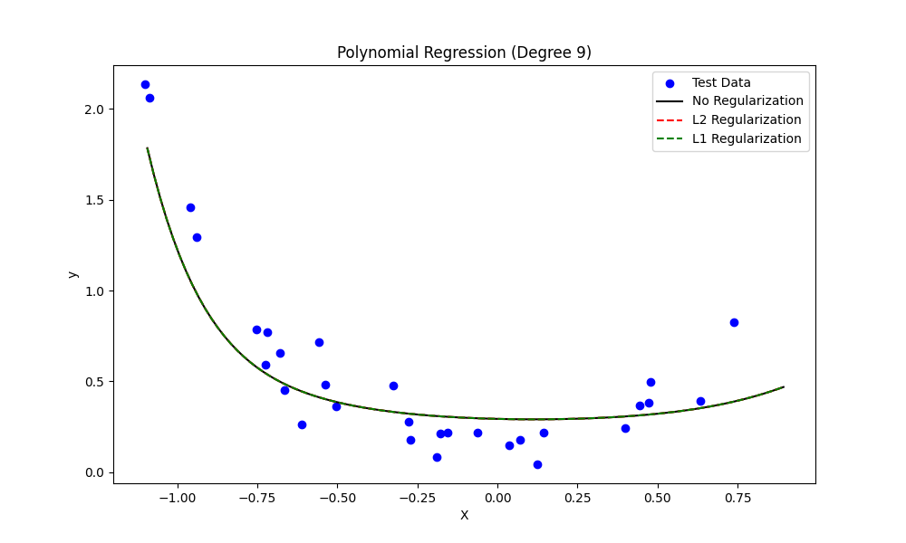

# SMAI Assignment 1

Devansh Kantesaria

2022112003

---

# K-Nearest Neighbours

## 2.2 Task 1
- I plotted all the different parameters in different plots of different kinds to visualize them. They are as follows.

## 2.3.1 Task 2
- A KNN class was created with 3 different distance matrices. Different methods were used to finally optimize the code to make it run faster. First, it was vectorized. Then,  instead of doing it in a for loop with each x checking for all the train points and then taking best k neighbors, and then sorting it all; instead, in the final version, it is happening parallely, in a batch size of 100. This helps in reducing time. Also the output labels were matches to a particular number, and then the accuracy, precision, etc were calculated.

## 2.4.1 Task 3

- The given split is made. Then, following are the top 10 pairs with most accuracy. The top k is 28, with manhattan.

| Rank | k  | Distance Metric | Accuracy |
|------|----|-----------------|----------|
| 1    | 28 | Manhattan       | 0.5904   |
| 2    | 31 | Manhattan       | 0.5816   |
| 3    | 40 | Manhattan       | 0.5781   |
| 4    | 30 | Manhattan       | 0.5772   |
| 5    | 11 | Manhattan       | 0.5693   |
| 6    | 15 | Manhattan       | 0.5693   |
| 7    | 47 | Manhattan       | 0.5693   |
| 8    | 23 | Manhattan       | 0.5649   |
| 9    | 35 | Manhattan       | 0.5649   |
| 10   | 43 | Manhattan       | 0.5640   |

- From this, we can observe that the highest accuracy achieved is nearly 59%. Also, manhattan distance matric calculation seems to outclass the other 2 by a lot, as all the top 10 values are from manhattan. Also, there is no specific pattern in the value of k.

-  The k vs accuracy plot is as follows.

- Now, the inital accuracy achieved after simple normalization and standardization was around 38%. SO, some features like `key`, `mode`, `liveness`and `valence` were dropped. On trialing, it was found that it was best to drop these colomns. This led to increase in accuracy to around 56%. Also note that other features like `track_id`, `artists`, `album_name`, `track_name` and the first colomn were already dropped as they were either completely empty, or, they had strings which did not seem useful in the calculation.

## 2.5.1

- The KNN is optimized by vectorization. Further explanation is already given above.

- The time inference plot is as follows. 

The KNN written by me has a large amount of scope for improvement, as the sklearn knn is wayy faster than mine. Also, I have plotted for 10% of the test data, meaning, the average time it will take to run the whole data will be around 120 seconds for me.(2 minutes). The initial KNN was much slower, leading to time of nearly 40 minutes for the whole data to run

- The inference time vs  train dataset size is as follows
| Dataset Size | Custom KNN Time (s) | Sklearn KNN Time (s) |
|--------------|---------------------|----------------------|
| 9120         | 1.2690              | 0.2505               |
| 18240        | 2.6838              | 0.3109               |
| 27360        | 3.2468              | 0.4225               |
| 36480        | 4.1046              | 0.4386               |
| 45600        | 5.4428              | 0.5139               |
| 54720        | 6.9620              | 0.6878               |
| 63840        | 7.9669              | 1.1334               |
| 72960        | 9.3367              | 0.7366               |
| 82080        | 10.5201             | 1.0860               |
| 91200        | 11.4541             | 0.9909               |

## 2.6

Now, the KNN is ran on different data set. Here, it was observed that the test data set was  way different from training data set to such a point that some outputs that were there in test, were not even there in train. SO, such cases had to be handeled. The final accuracy came out to be nearly 45%. Here are all the other parameters. 

Accuracy: 45.04%
Precision (Macro): 44.87%
Recall (Macro): 45.07%
F1 Score (Macro): 44.97%
Precision (Micro): 45.04%
Recall (Micro): 45.04%
F1 Score (Micro): 45.04%
 

# Linear Regression

First, the class of linear regression was made, using the gradiant method. Following are some split vizualizations done with the help of it. 
 

Also, the best learning rate is calculated
Best Learning Rate: 0.01

Learning Rate: 0.001, Train MSE: 0.5227, Val MSE: 0.4472, Test MSE: 0.8335
Learning Rate: 0.01, Train MSE: 0.3436, Val MSE: 0.2668, Test MSE: 0.4927
Learning Rate: 0.05, Train MSE: 0.3436, Val MSE: 0.2668, Test MSE: 0.4927
Learning Rate: 0.1, Train MSE: 0.3436, Val MSE: 0.2668, Test MSE: 0.4927
Learning Rate: 0.5, Train MSE: 0.3436, Val MSE: 0.2668, Test MSE: 0.4927

## 3.1.1

Frist, different values of lamda are tried.
Lambda: 0.001, Validation MSE: 0.2668
Lambda: 0.01, Validation MSE: 0.2668
Lambda: 0.1, Validation MSE: 0.2668
Lambda: 1, Validation MSE: 0.2670
Lambda: 10, Validation MSE: 0.2687
Lambda: 0, Validation MSE: 0.2668

The best lamda came out to be 0 in this case, or near to 0.

Best lambda: 0
Train set - MSE: 0.3436, R2: 0.7001
Validation set - MSE: 0.2668, R2: 0.7472
Test set - MSE: 0.4927, R2: 0.6534
Train set - MSE: 0.3436, Variance: 0.8022, Std Dev: 0.8956
Test set - MSE: 0.4927, Variance: 0.7454, Std Dev: 0.8634
Fitted line: y = 1.5555x + 0.8906
Here is the plot with the fitted line.
 

## 3.1.2

A new class is made for ployregression. It is run for different values of k and following is the result.

Degree | Train MSE | Train StdDev | Train Var | Test MSE | Test StdDev | Test Var
--------------------------------------------------------------------------------
     1 | 0.9474 | 0.0599 | 0.2447 | 0.5706 | 0.0585 | 0.2420
     2 | 0.9113 | 0.0562 | 0.2370 | 0.5546 | 0.0490 | 0.2214
     3 | 0.7905 | 0.0996 | 0.3156 | 0.4680 | 0.0925 | 0.3041
     4 | 0.7855 | 0.0974 | 0.3120 | 0.4668 | 0.0872 | 0.2954
     5 | 0.7224 | 0.1265 | 0.3556 | 0.4262 | 0.1180 | 0.3435
     6 | 0.7222 | 0.1259 | 0.3548 | 0.4262 | 0.1169 | 0.3419
     7 | 0.6822 | 0.1490 | 0.3860 | 0.4038 | 0.1417 | 0.3764
     8 | 0.6817 | 0.1508 | 0.3883 | 0.4036 | 0.1442 | 0.3797
     9 | 0.6542 | 0.1713 | 0.4138 | 0.3907 | 0.1653 | 0.4065
    10 | 0.6530 | 0.1756 | 0.4190 | 0.3906 | 0.1703 | 0.4127

Best k that minimizes error on test set: 10

Validation Metrics:
MSE: 0.19422420975028742
Standard Deviation: 0.2260969017273329
Variance: 0.05111980897069923

Test Metrics:
MSE: 0.10385488243845017
Standard Deviation: 0.2295634113527159
Variance: 0.052699359831896254

## 3.1.3
For this part, after each iteration, the image is stored. As we are doing for 1000 iterations, 1000 images are saved for each k. Then, those images are taken and a gif is made out of it. They are as following.

## 3.2.1
For the 5 degree polynomial, we get the following image

Also, it seems that L1 is marginally better.

Also, the 20 ploynomial degree plots are as follows.

   | 
   | 
   | 
   | 
   | 
   | 
   | 
   | 
   | 
 | 