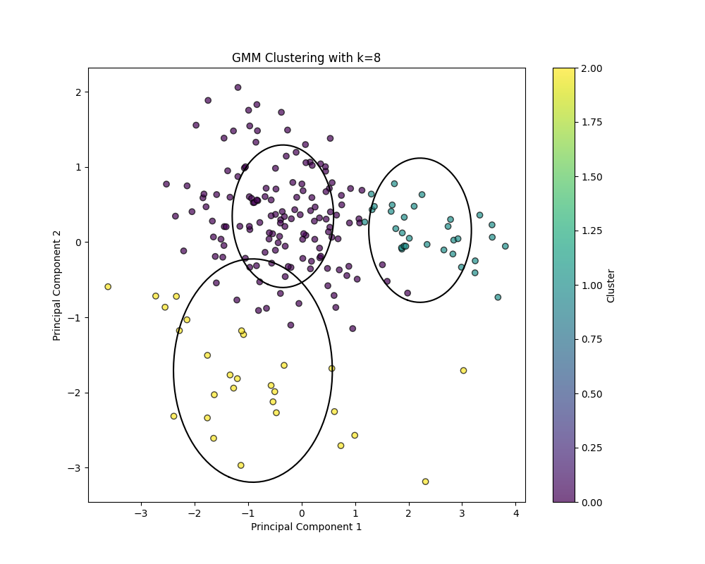
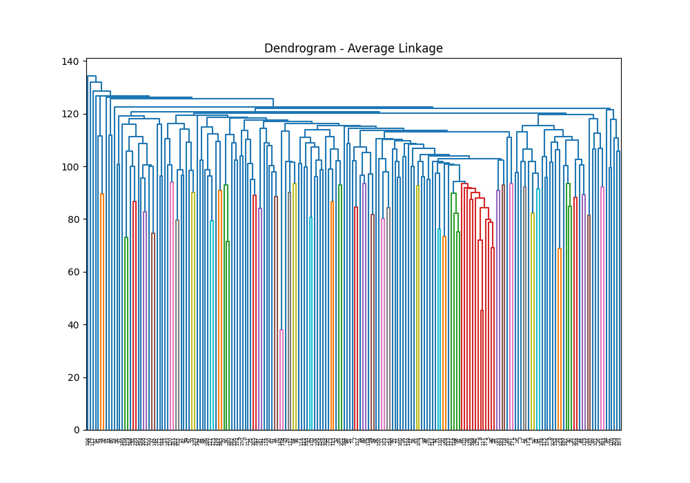

# SMAI Assignment 2

Devansh Kantesaria

2022112003

---

## K-Means Clustering

The K-means clustering is perfomed on the given data. On doing it for k=1 to 10, we get the following elbow plot.

From this, we can observe that at k=2, we can see the elbow point. So k_kmeans1=2.
Then taking that value, we can print each clusters, and also get the WCSS value, which is Final WCSS for k=2: 4252.951794441832

## GMM 

First, the GMM class is made according to what was told. 
The dataset given is of 512 dimensions. Hence, GMM clustering is not possible because the number of dimensions is too much. I tried this in both my GMM, and the inbuit GMM but was not able to perform clustering. Now, AIC and BIC are performed.
Following is the plot from the inbuit GMM

Optimal number of clusters (based on BIC): 1
Optimal number of clusters (based on AIC): 1

Following is the plot for the self made GMM

Optimal number of clusters (based on BIC): 1
Optimal number of clusters (based on AIC): 1

SO, k_gmm1=1

For both of AIC and BIC plots, we can see that mininum values are at 1, so the optimal number of clusters=1.

Doing gmm clustering for K=1, will mean there is only 1 cluster so all words will be in that one cluster.

## PCA 

First, the PCA class is made as told. Then, PCA is performed for 2 and 3 dimensions. 
2-D plot

3-D plot

The dataset is now reduced to lets say: 2 dimensions. The axes looks like they are 'nouns' and 'verbs'.

In the 3 dimensions, the axes looks like 'verbs', 'living things', 'non-living things'. For example:
"sit" word can be both living and verb(as living things sit)
"slide" can be both non-living, and a verb
"pencil" can be both livng and non-living(kind of)

On obeservation, it looks like number of clusters=3. So, k2=3.

Also, the checkPCA() for both 2D and 3D gives fasle, as expected. The threshold for information loss is kept at 1e-10. When reducing from 512 to 2/3 dimensions,much information will be lost and as expected, both came false.

## PCA + Clustering

### Kmeans

Taking k2=3, we perform Kmeans to get the following plot.

Now, the scree plots are made as follows.

If we want to retain the maximum information, we check the checkPCA() function. It gives true at 199, but flase at 198. So, we can take optimal dimensions as 199. But, if we want to provide maximum information in the least amount of dimensions, we see the scree plot, where we can see the slope is greatest at 2. So, n_optimal=2. The elbow plot for the same after kmeans is as follows.

From this, we can see that k_k_means3 = 2.
The final plot after clustering with value 2 is as follows.

### GMM
Taking k2=3, we perform Kmeans to get the following plot.

Now, doing the AIC BIC plot, we get

From here, we can see that least value is at k=3. so k_gmm3=3.
Here is the plot for the same

## Cluster Analysis

k_means1=2 
k_2=3
k_k_means3 = 2

For k=3, I got the following output
The Corresponding cluster words from the dataset are :

Cluster 1 :
-----------------------------------------------
drive | sing | listen | dive | flame | sit | knock | exit | brick | smile | bullet
bury | download | eat | postcard | hard | bend | fight | call | fly | face
climb | kneel | scream | kiss | passport | selfie | catch | hit | paint | far
dig | cry | notebook | run | clap | pull | sleep | hollow | puppy | clean
sad | empty | fish | slide | drink | draw | pray | arrest | email | buy
bird | burn | fire | close | angry | lazy | scary | hang | hammer | book
tattoo | earth | fingerprints | dustbin | tank | enter | key | swim | zip | happy
loud | love | cook | arrow | recycle | cut | walk | sunny | radio |

Cluster 2 :
-----------------------------------------------
deer | panda | ape | rose | helicopter | cat | needle | eraser | table | carrot | bear
spider | shark | grass | giraffe | forest | lizard | mug | frog | puppet | gym
lake | monkey | roof | stairs | rifle | cow | pencil | bed | starfish | plant
microwave | van | sweater | microphone | jacket | bench | sun | bucket | feet | boat
pear | peacock | saturn | fruit | grape | laptop | door | calendar | chair | mouse
ladder | finger | candle | ant | igloo | goldfish | clock | oven | calculator | spiderman
bee | pillow | tree | beetle | envelope | snake | length | rain | airplane | ambulance
pizza | television | throne | tent | camera | tomato | dragonfly | parachute | butterfly | car
loudspeaker | lantern | telephone | elephant | pant | stove | rainy | wheel | windmill | toaster
potato | crocodile | shoe | keyboard | truck | suitcase |

Cluster 3 :
-----------------------------------------------
fishing | brush | feather | spoon | knit | cigarette | baseball | basket | flute | scissor | badminton
skate | toothbrush | screwdriver | teaspoon | sword | knife | toothpaste | basketball | bicycle | comb
fork | paintbrush |

In this, cluster 1 mostly contains of verbs, cluster 2 contains mostly living things, and cluster 3 mostly contains non-living things.
There are some outliers, but still, on running it multiple times, it gives nearly the same result.
For K=2:

Cluster 1 :
--------------------------------------------

deer | panda | ape | helicopter | cat | needle | eraser | table | carrot | fishing | bear | spider | shark | grass | giraffe | forest | lizard | brush | mug | feather | spoon | frog | puppet | gym | lake | monkey | roof | stairs | rifle | cow | pencil | bed | starfish | plant | microwave | knit | van | sweater | cigarette | microphone | jacket | bench | sun | bucket | feet | boat | pear | peacock | saturn | flute | fruit | scissor | grape | laptop | door | calendar | badminton | chair | mouse | ladder | finger | candle | ant | igloo | goldfish | clock | oven | calculator | spiderman | bee | pillow | tree | beetle | envelope | toothbrush | screwdriver | fingerprints | teaspoon | length | dustbin | airplane | ambulance | pizza | television | throne | tent | camera | tomato | dragonfly | parachute | butterfly | car | sword | loudspeaker | lantern | telephone | elephant | pant | stove | rainy | toothpaste | wheel | bicycle | windmill | toaster | potato | comb | crocodile | keyboard | fork | suitcase | paintbrush

Cluster 2 :
-----------------------------------------
drive | sing | listen | rose | dive | flame | sit | knock | exit | brick | smile | bullet | bury | download | eat | postcard | hard | bend | fight | call | fly | face | climb | kneel | scream | kiss | passport | selfie | catch | hit | paint | far | dig | cry | notebook | run | clap | pull | sleep | baseball | hollow | puppy | clean | basket | sad | empty | fish | slide | drink | draw | pray | arrest | email | buy | bird | burn | fire | close | angry | lazy | scary | hang | skate | hammer | book | snake | tattoo | earth | rain | tank | enter | key | swim | zip | happy | loud | love | knife | cook | basketball | arrow | recycle | cut | shoe | walk | sunny | radio | truck

In this, cluster 1 mostly contains nouns, while cluster 2 mostly contains verbs.

I think that k=3 is much better.

k_gmm1=1
k_2=3
k_gmm3=3

For only 1 cluster, all words will belong to that cluster.

For 3 clusters, values are as follows.

Cluster 1:
----------------------------------------
sing | listen | flame | knock | bury | download | postcard | hard | fight | call | catch | hit | paint | far | cry | sleep | clean | slide | drink | draw | pray | email | burn | fire | close | lazy | scary | hang | book | enter | happy | loud | love | cook | recycle

Cluster 2:
--------------------------------------
panda | ape | sit | cat | eat | gym | rifle | cow | pencil | bed | starfish | dig | run | van | sun | sad | peacock | ant | buy | bee | camera | tomato | car | lantern | elephant | pant | potato | crocodile

Cluster 3:
--------------------------------------
drive | deer | rose | dive | helicopter | needle | eraser | table | carrot | exit | brick | fishing | smile | bear | spider | bullet | shark | grass | giraffe | forest | lizard | brush | mug | feather | spoon | bend | frog | puppet | fly | lake | face | climb | kneel | scream | monkey | kiss | passport | selfie | roof | stairs | plant | microwave | notebook | clap | pull | knit | sweater | cigarette | microphone | baseball | hollow | jacket | bench | bucket | puppy | feet | boat | pear | basket | empty | fish | saturn | flute | fruit | scissor | grape | laptop | door | calendar | badminton | chair | mouse | ladder | arrest | finger | candle | igloo | goldfish | bird | clock | oven | calculator | spiderman | pillow | angry | tree | beetle | envelope | skate | hammer | toothbrush | screwdriver | snake | tattoo | earth | fingerprints | teaspoon | length | dustbin | rain | tank | airplane | ambulance | pizza | television | throne | key | swim | tent | zip | dragonfly | parachute | butterfly | sword | loudspeaker | telephone | stove | rainy | knife | toothpaste | basketball | wheel | bicycle | windmill | arrow | toaster | comb | cut | shoe | walk | keyboard | fork | sunny | radio | truck | suitcase | paintbrush

Here, cluster 1 contains verbs, while cluster 2 contains items. Cluster 3 contains rest of the words, as there is no proper distinction.

Still, the optional k value of GMM is 3, as clusters are somewhat defined.

Comparing between Kbest_means, and Kbest_gmm, both the values are same. But, the cluster of Kbest_means are better defined, so that is more preffered over GMM.

## Hierarchical Clustering

Here, hierarchical Clustering is performed by all the possible methods. The plots are shown below.

  |  
 |  
 |  

We can also try other distance methods like manhattan. Some plots are as follows.

 

But, most of the methods like ward, centeriod, median, etc only work on Euclidean distance matric.

From these, we can clearly see that the ward method is the best as it has even distribution while others have sked distribution.
Now, plotting for kbest1=3, we get
 

Now, plotting for kbest2=3, we get

 

Both have the same number of clusters=3. So, the distribuiton will be same, and will be as follows.

Cluster 1:
-----------------------------------------------
sing | listen | dive | flame | knock | exit | brick | smile | bury | download | hard | bend | fight | face | scream | kiss | selfie | catch | hit | paint | far | cry | sleep | hollow | clean | sad | empty | slide | drink | door | draw | pray | arrest | buy | burn | fire | close | angry | lazy | scary | hang | tattoo | earth | enter | key | swim | happy | loud | love | cook | cut

Cluster 2:
----------------------------------------------
deer | panda | ape | sit | cat | eraser | carrot | bear | spider | shark | grass | giraffe | forest | lizard | feather | eat | frog | puppet | fly | gym | kneel | monkey | cow | pencil | starfish | plant | dig | run | clap | pull | sun | puppy | feet | pear | peacock | fish | fruit | grape | finger | ant | goldfish | bird | spiderman | bee | tree | beetle | snake | fingerprints | rain | zip | tomato | dragonfly | butterfly | elephant | pant | rainy | potato | crocodile | shoe | sunny

Cluster 3:
-----------------------------------------------
drive | rose | helicopter | needle | table | fishing | bullet | brush | mug | postcard | spoon | call | lake | climb | passport | roof | stairs | rifle | bed | microwave | notebook | knit | van | sweater | cigarette | microphone | baseball | jacket | bench | bucket | boat | basket | saturn | flute | scissor | laptop | calendar | badminton | chair | mouse | ladder | email | candle | igloo | clock | oven | calculator | pillow | envelope | skate | hammer | toothbrush | book | screwdriver | teaspoon | length | dustbin | tank | airplane | ambulance | pizza | television | throne | tent | camera | parachute | car | sword | loudspeaker | lantern | telephone | stove | knife | toothpaste | basketball | wheel | bicycle | windmill | arrow | recycle | toaster | comb | walk | keyboard | fork | radio | truck | suitcase | paintbrush

Here, the first cluster mostly consists of verbs. Then 2nd cluster consists of living things, while the 3rd cluster consists of non-living things. I think these clusters are better than what we got from Kmeans, as the "living things" cluster there had many inconsistancies. They are also better than Kgmm, because the 3rd cluster in Kgmm is not properly defined.

## PCA + KNN

PCA+KNN is perfomed. First, the scree plot is obtained, which is as follows.

Here, on keeping the threshold to be 90%, we get Optimal number of components: 9

Optimal number of components: 9

Test Accuracy: 45.57%

Test Precision (Macro): 44.65%

Test Recall (Macro): 45.25%

Test F1 Score (Macro): 43.84%

Test Precision (Micro): 45.57%

Test Recall (Micro): 45.57%

Test F1 Score (Micro): 45.57%

Comparison with Assignment 1 results:

Accuracy: 45.5702 vs 56.3200

Precision (Macro): 44.6524 vs 57.3300

Recall (Macro): 45.2486 vs 55.9100
F1 Score (Macro): 43.8438 vs 56.6100

Precision (Micro): 45.5702 vs 56.3200

Recall (Micro): 45.5702 vs 56.3200

F1 Score (Micro): 45.5702 vs 56.3200

We can see that the accuracy etc have decreased. This might be becasue of loss in the data informaion while reducing the dimensions.

Now, following are the results in inference time.

Inference time (Full Dataset): 90.2310 seconds

Inference time (Reduced Dataset): 71.8630 seconds

We can see that the time has reduced slightly, probably due to reduction in dimension from 12 to 9.