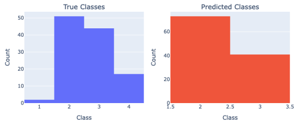
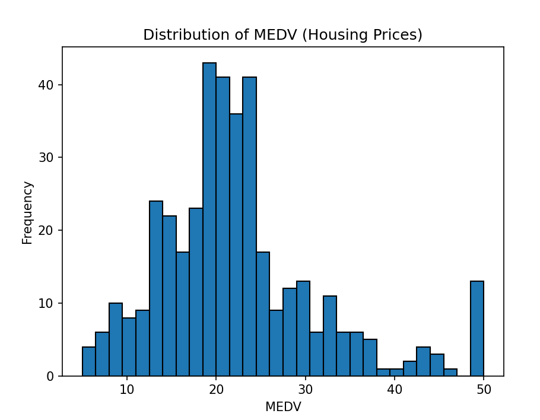

# SMAI Assignment 3

Devansh Kantesaria

2022112003

---

## 2. Multi Layer Perceptron Classification

### 2.1 Dataset Description


The null values have been replaced with the mean value of that column.

The following shows the data distribution


### 2.2 

An MLP class is built, and this is later integrated in a unifedMLP class.

A sample run is done, and the gradients are checked. They are as follows.

Comparison of Numerical vs. Backpropagation Gradients:
Gradient 1: Numerical = 0.037936, Backpropagation = 0.037936
Gradient 2: Numerical = 0.732384, Backpropagation = 0.732384
Gradient 3: Numerical = 0.744383, Backpropagation = 0.744383
Gradient 4: Numerical = -1.642732, Backpropagation = -1.642732
Gradient 5: Numerical = 1.325786, Backpropagation = 1.325786
Gradient 6: Numerical = -2.089629, Backpropagation = -2.089629
Gradient 7: Numerical = -0.040976, Backpropagation = -0.040976
Gradient 8: Numerical = 0.021721, Backpropagation = 0.021721
Gradient 9: Numerical = 0.000000, Backpropagation = 0.000000
Gradient 10: Numerical = -0.454651, Backpropagation = -0.454651

The final output is
Epoch 100/100, Train Loss: 0.7349864886342445 
Accuracy: 57.46%


### 2.3

Now we perform hyper-parameter tuning.

A parallel plot is generated first.


Then, overall variations over the 6 features are observed in the weights and biases plots.


The full table is as follows


https://api.wandb.ai/links/devansh-kantesaria-iiit-hyderabad/d0mmdqzw

### 2.4

The following hyper-parameters gave the best results (Accuracy: 59.38%):
```
activation_function: "relu"
learning_rate: 0.01
batch_size: 32
epochs: 200
hiddden_layers: [64, 16]
optimizer: "mini-batch"
```

- Train Accuracy: 0.6575
- Train Cost: 0.5923
- Validation Accuracy: 0.5938
- Validation Cost: 1.456
- Validation F1 Score: 0.5557
- Validation Precision: 0.58132
- Validation Recall: 0.5913
- Accuracy: 0.5938
- F1 Score: 0.5951

### 2.5


#### Effect of Non-Linearity


Sigmoid and linear converge similarly, and so do relu and tanh, showing that relu and tanh give less loss, which is evident when we see the paramaters with highest accuracy.


#### Effect of Learning Rate


Slow learning rate implies that the loss is not able to reduce drastically, and we observe this with
the learning rate as 0.001. This will lead to convergence but too slowly.
With too high of a learning rate, there is a possibility of skipping over the minima to get a higher
value instead, which is evident by the up-down spikes for learning rate as 0.1. This might not lead to convergence, as the graph is haphazard.
An ideal learning rate is something in the between which neither goes too slow nor too fast around 0.01 or 0.005. We can also see that in our overall results.


#### Effect of Batch Size


Larger batch sizes lead to slower convergence than smaller batch sizes.


We can see all these paramaters play a role, when we get the best output.


### 2.6

The multilable class is made, and is also integrated in UnifiedMLP. All the required matrices are made. 

We get an accuracy of about 61.245%.
The recall and precision are as follows.


The complete confusion matrix is as follows.


### 2.7




From this,we can see that t the model has almost learnt to predict classes 2 and 3 and the rest of the classes are almost like outliers which are never predicted by the model. This is due to the uneven distribution in the original dataset as it is not stratified. Hence, the model is pridicting based on distribution of classes.


From the confusion matrix of multilable classification we saw above, we didnt see any particular bias towards any class.


## 3. Multilayer Perceptron Regression


### 3.1 

Here is the distribution of the data for MEDV


Once again the null values present in the dataset and have been replaced with the mean value of that column

### 3.2
The MLPRegressor class is created with both mse and bse loss, and then it is merged in unifiedMLP.

### 3.3


https://api.wandb.ai/links/devansh-kantesaria-iiit-hyderabad/pv0rme9v


The best parameters we get are(lowest mse)

- activation_function: "relu"
- batch_size: 32
- epochs: 1000
- learning_rate: 0.1
- num_neurons: [32, 16]
- optimizer: "sgd"

### 3.4
for the best model, these are the outputs.

MSE:0.0042533
MAE:0.059314
R_squared: 0.7669


### 3.5

The plot for MSE vs BSE is as follows.


Both seems to follow the same pattern for decrease. BSE has more irregularities than MSE. But, if we pay a closer look at the y-axis, we observe that MSE perform far better than BSE. Hence, overall, MSE will follow a kind of logarithmic decrease, while BSE will be slower and probably linear.


### 3.6


We can see that most predicted values are nearly same as the actual values. But we can clearly see few outliers at the actual value of 50

### 3.7

Everything is combined under UnifiedMLP class


## 4. AutoEncoders

### 4.1

The existing MLP Regression class is used for implementing the autoencoder. Input and Reduced dimensions are taken as parameters and the autoencoder uses a MLP network of input - hidden - reduced - hidden_reversed - output neurons where input and output have the same number of neurons. The initialisation method sets up this architecture based on the inputs. The fit method calls the MLP fit method with both X and y values as X. SO, X,X is taken in fit. The get_latent method returns the values in the reduced layer after activation.
In assignment 2, the reduced dimension is 9, by PCA. Hence, the model should reduce the dimensions from 12 to 10 to 9, and again from 9 to 10 to 11 to 12.

### 4.2

The autoecoder is trained by the following parameters
AutoEncoder(input_size=12, hidden_layers=[10, 9], latent_dim=9, lr=0.01, epochs=50, batch_size=32, activation="sigmoid")

### 4.3

Here are the outputs for AutoEncoder+KNN (Assignment 3) (k=28)

F1 Score: 0.3436
Accuracy: 0.3566
Precision: 0.3491
Recall: 0.3580

Here is the output from Assignment 1 (k=28)

Accuracy: 56.3200%
Precision : 57.3300%
Recall : 55.9100%
F1 Score : 56.6100%


Here is the output from assignment 2


Test Accuracy: 45.57%

Test Precision : 44.65%

Test Recall : 45.25%

Test F1 Score: 43.84%


We can see that the accuracy etc have decreased for PCA. This might be becasue of loss in the data informaion while reducing the dimensions. But, for Autoencoder, the accuracy etc have reduced even more, coming to be around 35%. This might be becasue PCA does a better job in retaining the information than Autoencoder does.

### 4.4

Now, normal MLP is run of the spotify data set. Here are the results

MLP Classifier Results:
 F1 Score: 0.19435797057333884
 Accuracy: 0.2693421052631579
 Precision: 0.22534819388827448
 Recall: 0.2656405565912657

The accuracy is 27% on the entire dataset when using MLP for classification. Using KNN on the entire processed dataset, the accuracy was 56%, implying KNN does a better job in single label classification compared to MLP. It might be because random MLP parameters are chosen, while for KNN was tuned and best k was chosen. KNN is also simple to tune while MLP is complex. If the hyperparameters for MLP were chosen properly and tuned, then even MLP might give comparable results.