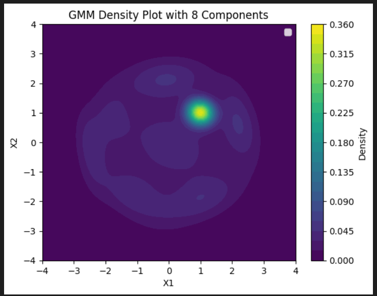

# SMAI Assignment 5

Devansh Kantesaria

2022112003

---

# KDE

## 2.1 
- KDE class is made and then, I tested on a random dataset to visualize it.

## 2.2 

- The dataset is reconstructed and it looks as follows

## 2.3

- Both KDE and GMM are fitted in the model(self made GMM class), and the outputs are as follows.

#### GMM
- Observations with GMM (2 Components)
- Cluster Representation: When using 2 components, the GMM model tries to divide the data into two broad Gaussian distributions. If the data contains more than two distinct clusters, these two components might overlap or fail to capture the true distribution of the data.
- Underfitting: The model may underfit the data as it lacks the flexibility to represent all distinct clusters, leading to oversimplified boundaries and less accurate density estimation.

- Beyond that,  it may fit, till an optimal number(after which it will start overfitting). The model becomes more flexible and can capture fine variations also. In 4 components, it looks like it is fitting, while with 8 components, it looks like it is over fitting.

#### KDE

- KDE is a non-parametric method, meaning it does not rely on an assumption about the number of clusters or the underlying data distribution.
- It adapts to the data directly using the bandwidth parameter, providing a smoother or finer estimation depending on the value of the bandwidth.
- KDE consistently fits the data but does not explicitly model clusters as GMM does. It provides a general density estimate rather than identifying and characterizing distinct groups.

# HMM

## 3.1

HMM model has to be made

## 3.2

Data is downloaded and below is the MFCC visualization.

Following are the reasons why this is suitable.

1. Temporal Dependencies in Speech:
Speech is inherently a sequential process where each sound depends on the sounds before and after it.
MFCC features capture the spectral properties of audio over time, and the time-varying patterns in the MFCC heatmaps (e.g., gradual changes in energy across coefficients) highlight these temporal dependencies.
HMMs are explicitly designed to model sequences with probabilistic transitions between states, making them suitable for capturing these temporal dynamics.
2. State Representation of Phonemes:
Speech signals can be decomposed into smaller units like phonemes, which correspond to distinct sound patterns.
In the context of speech recognition, each phoneme or sound can be represented as a state in an HMM.
3. Sequential Structure in MFCCs:
The MFCC plots often show gradual shifts in the coefficients, reflecting the transitions between different phonemes or words in the audio.
HMMs are well-suited for modeling such sequences because they account for the likelihood of moving from one state (sound/phoneme) to another, capturing the natural flow of speech.
4. Variability and Noise Handling:
MFCC patterns show variability due to differences in pronunciation, pitch, and noise. HMMs can model this variability through:
Emission probabilities: These account for the distribution of MFCC features within a state.
Transition probabilities: These allow flexibility in timing, accommodating natural variations in speech duration.

## 3.3

HMM is trained for each digits, and following is the accuracy.
Accuracy on test set: 91.33%

## 3.4

Accuracy on provided test set: 91.33%
Accuracy on personal recordings: 10.00%

Comparison of model performance:
Provided Test Set Accuracy: 91.33%
Personal Recordings Accuracy: 10.00%

10% accuracy menas it is bascailly guessing. The reasons for this can be as below.

1. Training/Test Data Consistency: The model is trained and evaluated on the provided dataset, which likely has consistent recording conditions (e.g., microphone quality, background noise, speaking style).
2. Personal Recordings: These are likely recorded under different conditions, with different microphones, environments, accents, and speech rates. Such variations can introduce significant differences in audio features like MFCCs, causing the model to fail on these recordings.
3. Pronunciation, accent, and speech rhythm might vary in the self made dataset, from the original one.
4. Recording Quality: If the personal recordings have low clarity or volume, the extracted MFCCs may not represent the intended digit sounds well.
 

# RNN

## 4.1 Counting Bits

### 4.1.1

A data set is generated

Examples from the dataset:
                                        sequence  count
0  [0, 1, 0, 0, 0, 1, 0, 0, 0, 1, 0, 0, 1, 1, 1]      6
1     [0, 0, 0, 1, 1, 0, 1, 1, 0, 0, 1, 0, 1, 1]      7
2              [0, 0, 1, 1, 1, 0, 0, 1, 1, 0, 1]      6
3        [0, 0, 1, 0, 1, 0, 0, 0, 0, 0, 0, 0, 1]      3
4                    [1, 0, 1, 1, 1, 0, 0, 1, 1]      6
Training set size: 80000
Validation set size: 10000
Test set size: 10000

### 4.1.2

I tested with many models, one of the example is this

input_size = 1  
hidden_size = 32  
num_layers = 2 
dropout = 0.2  
rnn_type = 'LSTM' 

Epoch 1/20, Train Loss: 2.5429, Val Loss: 0.0380
Epoch 2/20, Train Loss: 0.0370, Val Loss: 0.0138
Epoch 3/20, Train Loss: 0.0225, Val Loss: 0.0172
Epoch 4/20, Train Loss: 0.0162, Val Loss: 0.0035
Epoch 5/20, Train Loss: 0.0146, Val Loss: 0.0032
Epoch 6/20, Train Loss: 0.0130, Val Loss: 0.0043
Epoch 7/20, Train Loss: 0.0107, Val Loss: 0.0025
Epoch 8/20, Train Loss: 0.0102, Val Loss: 0.0040
Epoch 9/20, Train Loss: 0.0090, Val Loss: 0.0022
Epoch 10/20, Train Loss: 0.0101, Val Loss: 0.0029
Epoch 11/20, Train Loss: 0.0078, Val Loss: 0.0020
Epoch 12/20, Train Loss: 0.0088, Val Loss: 0.0018
Epoch 13/20, Train Loss: 0.0071, Val Loss: 0.0030
Epoch 14/20, Train Loss: 0.0087, Val Loss: 0.0030
Epoch 15/20, Train Loss: 0.0077, Val Loss: 0.0025
Epoch 16/20, Train Loss: 0.0074, Val Loss: 0.0023
Epoch 17/20, Train Loss: 0.0051, Val Loss: 0.0149
Epoch 18/20, Train Loss: 0.0058, Val Loss: 0.0023
Epoch 19/20, Train Loss: 0.0057, Val Loss: 0.0018
Epoch 20/20, Train Loss: 0.0050, Val Loss: 0.0018

### 4.1.3

A random basline was taken and again the model was run with the above parameters. The result is as follows.

Epoch 1/10, Train Loss: 2.5307, Val Loss: 0.0315, MAE: 0.0880
Epoch 2/10, Train Loss: 0.0362, Val Loss: 0.0094, MAE: 0.0430
Epoch 3/10, Train Loss: 0.0212, Val Loss: 0.0078, MAE: 0.0495
Epoch 4/10, Train Loss: 0.0262, Val Loss: 0.0141, MAE: 0.0982
Epoch 5/10, Train Loss: 0.0166, Val Loss: 0.0044, MAE: 0.0368
Epoch 6/10, Train Loss: 0.0171, Val Loss: 0.0036, MAE: 0.0357
Epoch 7/10, Train Loss: 0.0123, Val Loss: 0.0030, MAE: 0.0274
Epoch 8/10, Train Loss: 0.0125, Val Loss: 0.0024, MAE: 0.0194
Epoch 9/10, Train Loss: 0.0101, Val Loss: 0.0034, MAE: 0.0258
Epoch 10/10, Train Loss: 0.0115, Val Loss: 0.0061, MAE: 0.0606
Random Baseline MAE: 5.4827

### 4.1.4

1. Training Performance (Sequence Lengths: 1–16)
Observation: The MAE is low (near zero) for sequence lengths within the training range.

- Reason:

 The model has successfully learned to count bits for sequence lengths it has seen during training.
This demonstrates that the model fits the training data well and accurately predicts for sequence lengths in the 1–16 range.

- Conclusion:
The model generalizes well to the training distribution.
There are no significant issues with overfitting to the training data.

2. Generalization Performance (Sequence Lengths: 17–32)
Observation: The MAE gradually increases as the sequence length increases beyond the training range.

- Reason:

Extrapolation Difficulty: The model struggles to generalize to sequence lengths it has never seen during training because longer sequences introduce more complexity (e.g., higher counts of 1s, more positional variations).
Capacity Limitations: The model may not have sufficient capacity (e.g., number of layers, hidden units) to handle longer sequences effectively.
Bias Towards Training Distribution: The model may have implicitly learned biases specific to shorter sequences (e.g., lower average counts of 1s) and fails to adapt to the characteristics of longer sequences.
- Conclusion:

The model's generalization is imperfect, but the gradual increase in MAE suggests it is extrapolating to some extent.
The performance is better than random guessing but highlights the challenge of out-of-distribution generalization.

## 4.2 Optical Character Recognition

### 4.2.1

The 100,000 words dataset is created from nltk.corpus. Then, it was divided into test, train, and validation datasets.

Total files: 99584
Training files: 79667
Validation files: 9958
Test files: 9959

Sample of training files: ['A.png', 'Aani.png', 'Aaronite.png', 'Aaronitic.png', 'Ab.png']
Sample of validation files: ['Abranchiata.png', 'Absalom.png', 'Acanthocereus.png', 'Aceratherium.png', 'Achromobacter.png']
Sample of test files: ['Ababua.png', 'Abelite.png', 'Acephalite.png', 'Achaemenian.png', 'Achamoth.png']

### 4.2.2

The OCR model class is made. Below is one of the paramaters it is worked on.
CRModel(
  (cnn): Sequential(
    (0): Conv2d(3, 32, kernel_size=(3, 3), stride=(1, 1), padding=(1, 1))
    (1): ReLU()
    (2): MaxPool2d(kernel_size=2, stride=2, padding=0, dilation=1, ceil_mode=False)
    (3): Conv2d(32, 64, kernel_size=(3, 3), stride=(1, 1), padding=(1, 1))
    (4): ReLU()
    (5): MaxPool2d(kernel_size=2, stride=2, padding=0, dilation=1, ceil_mode=False)
  )
  (rnn): GRU(4096, 256, num_layers=2, batch_first=True)
  (fc): Linear(in_features=256, out_features=65, bias=True)
)

### 4.2.3

The loop is ran and below are the following results.
Starting training...
Epoch 1/5
Train Loss: 2.7455
Val Loss: 2.7297
Character Accuracy: 0.1032
--------------------------------------------------
Epoch 2/5
Train Loss: 2.7285
Val Loss: 2.7354
Character Accuracy: 0.1034
--------------------------------------------------
Epoch 3/5
Train Loss: 2.7279
Val Loss: 2.7284
Character Accuracy: 0.1103
--------------------------------------------------
Epoch 4/5
Train Loss: 2.7295
Val Loss: 2.7216
Character Accuracy: 0.1113
--------------------------------------------------
Epoch 5/5
Train Loss: 2.7291
Val Loss: 2.7298
Character Accuracy: 0.1113
--------------------------------------------------

Example 1:
True: wabe
Pred: sereeeeeeeeeeeee

Example 2:
True: interfemoral
Pred: sereeeeeeeeeeeee

Example 3:
True: satirical
Pred: sereeeeeeeeeeeee

The average number of correct characters will be (character accuracy * string length). 
And, the random baseline would be (1/52 * string length). So random character baseline accuracy would be 0.01785.